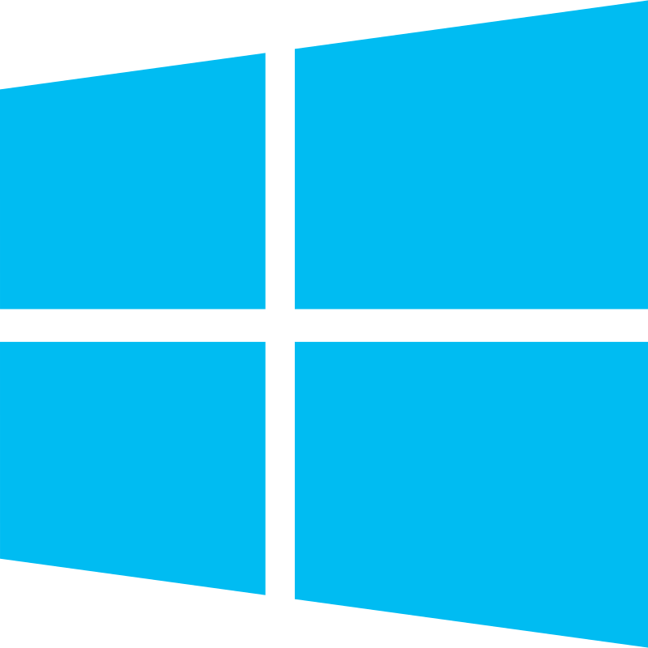
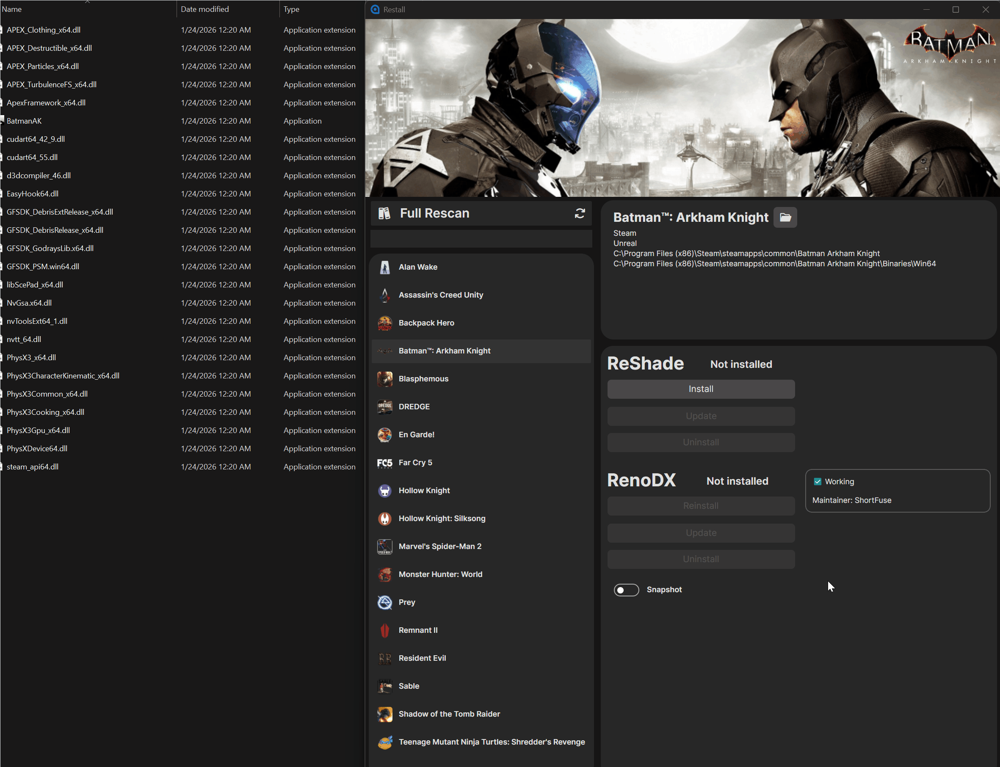
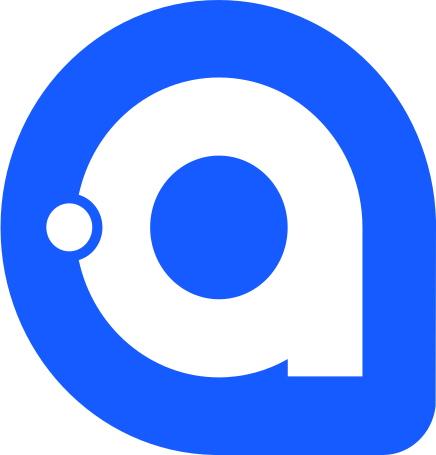
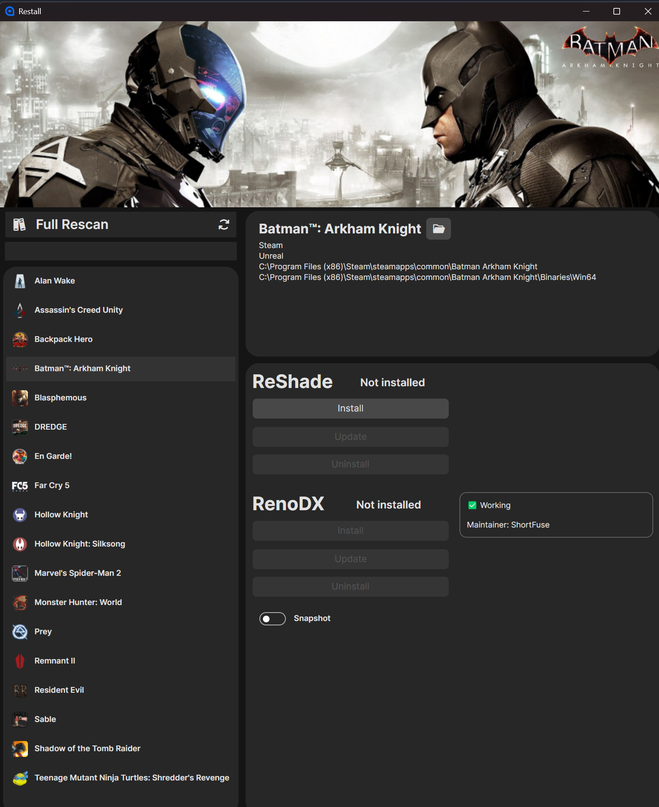
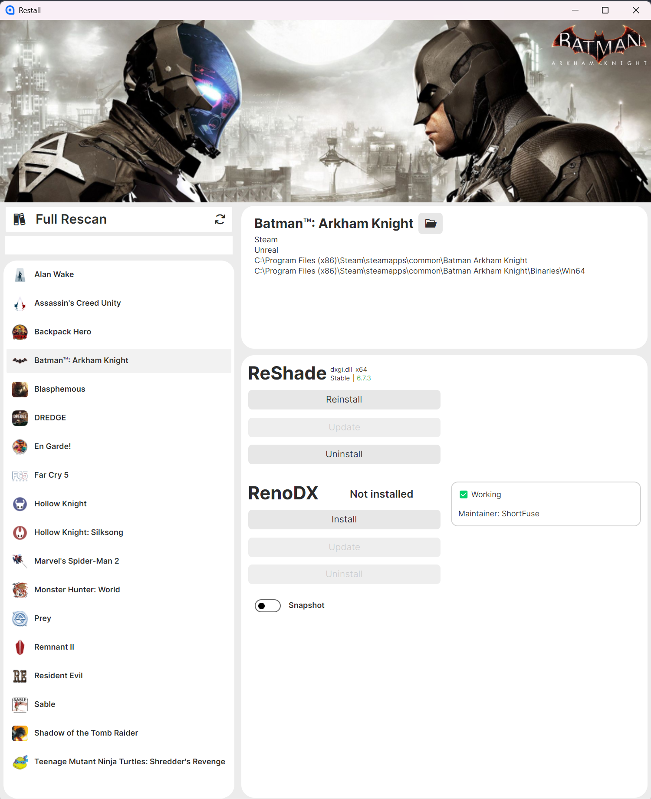

# Restall

---
## Table of Contents
* [What is Restall?](#what-is-restall)
* [Building the Project](#building-the-project)
    * [Prerequisites](#prerequisites)
    * [Cloning the Repository](#cloning-the-repository)
* [How to use Restall](#how-to-use-restall)
* [Technical Aspects](#technical-aspects)
* [Screenshots](#screenshots)
* [Upcoming Features](#upcoming-features)
---
## What is Restall?
**Restall** is a desktop application for Windows and Linux for managing [ReShade](https://reshade.me/) and [RenoDX](https://github.com/clshortfuse/renodx/) modifications. 

> Think of it as a mod-manager for those two with the "Plug'n'Play" mentality, no more manual file hunting across game directories. 

It automates the detection of game installations across multiple launchers and simplifies the mod management, **_Install, Update and Delete_**, of post-processing and HDR enhancement tools.

### Supported Launchers

| &nbsp;&nbsp;Windows | &nbsp;&nbsp;Linux |
| :--- | :--- |
|  Steam |  Steam (Native/Proton) |
|  Epic Games Launcher | Epic Games (via [Heroic](https://heroicgameslauncher.com/)) |
|  GOG |  GOG (via [Heroic](https://heroicgameslauncher.com/)) |
|  Ubisoft Connect | |
|  EA App | |
---
## Building the Project

### Prerequisites
* [Git](https://git-scm.com/install)
* [Docker Desktop](https://www.docker.com/get-started/) for Windows 10/11 
* the `docker` package for Linux 

### Cloning the Repository
* ```git clone https://github.com/fornkatt/Restall.git cd Restall```

| &nbsp;&nbsp;Windows | &nbsp;&nbsp;Linux |
| :--- | :--- |
| • Download and install the latest version of Docker and run it | • Install the **docker package** for your distribution <br> &nbsp;&nbsp;&nbsp;&nbsp;• _Install the `docker-buildx` plugin if it is not included in your distribution package_ <br> • Open up the terminal and run ```systemctl start docker``` <br> • Run ```usermod -aG docker $USER``` to add your user to the docker group <br> • Run ```newgrp docker``` to apply changes or relog |
| • Double-click ```build-windows_win.bat``` to build Windows binaries <br> • _Alternatively, use `build-linux_win.bat` for Linux binaries_ | • Navigate to the repo and run ```chmod +x build-linux_linux.sh``` <br> • _Alternatively, use `chmod +x build-windows_linux.sh`_ |
| • The final build will be in `dist/windows` or `dist/linux`. | • The final build will be in `dist/linux` or `dist/windows`. |


---
## How to use Restall
### The general workflows looks like:
* Launch Restall - it will automatically detect your installed game launchers
    * Select a game from the detected game list
        * Choose a mod Select a desired version from the list
            * Install, Update or Delete the mod directly from the application

* Below is a quick demo of the full workflow:



--- 

## Technical Aspects
### Core Frameworks & Language
<p>


</p>

Restall is built with **C#** and **.NET 10** and we are using **Avalonia UI** for rendering.

---

### Libraries & Tools
| Library/Tool | Purpose |
| :--- | :--- |
| CommunityToolkit.Mvvm | MVVM pattern & source generators |
| PeNet | PE file parsing for mod compatibility checks |
| SteamGridDB API | Fetching game artwork |
| HtmlAgilityPack | Web scraping for mod metadata |
| Docker | Cross-platform build environment |

---

## Screenshots

* Restall features a dynamic theme system and offers full support for Dark- and Light mode.

| Dark Mode | Light Mode |
| :---: | :---: |
|  |  |

---

## Upcoming Features

> This section will be updated as new features are planned and confirmed.

