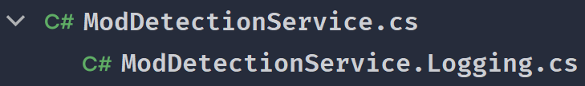
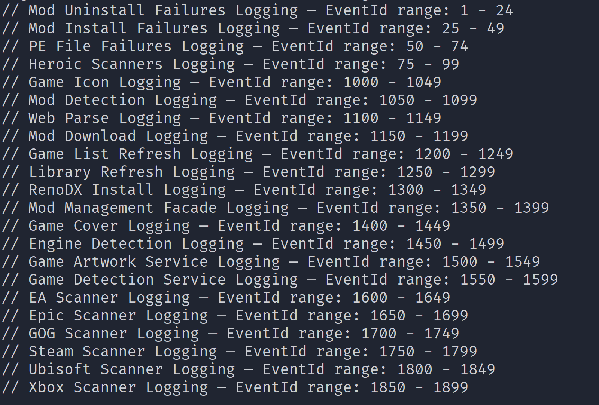
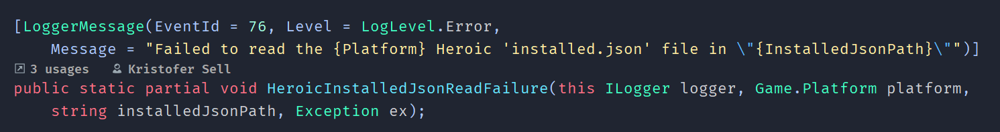
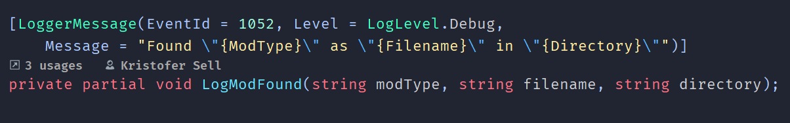

# Restall Logging

--- 

## Tables of Contents
* [Preface](#preface)
* [Implementation](#implementation)
    * [EventIDs and Allocations](#eventids-and-allocations)
* [Logging Example](#logging-example)
    * [Message and naming conventions](#message-and-naming-conventions)    
* [Loglevels and Architecture](#loglevels-and-architecture)
    * [The Healthy-system Test](#the-healthy-system-test)
    * [Where should you log](#where-should-you-log)
* [PR Checklist](#pr-checklist)

---

## Preface

Restall is using a logging system through `Microsoft.Extensions.Logging` with Serilog. We consider this documentation to be _THE_ single source of truth for how we handle logging in the project. We log to track what went wrong with our features, where it happened and to answer the question _"Why didn't this work as expected?"_ 

Below you can see the strict conventions that we expect you to follow if you want to contribute:

- Pattern: `partial` methods using `[LoggerMessage]` attribute.
- Golden Rule: The naming convention and patterns are strictly required if you are contributing in our project. To see how the logging is handled and structured, go to [Logging Example](#logging-example) section.

Before you submit a Pull Request. We highly suggest you to verify your log methods against our [PR Checklist](#pr-checklist). 

---

## Implementation
Our logs are divided into two categories, Global and Scoped.

> **Global logs** are shared across multiple classes and live in a centralized file. **Scoped logs** belong entirely to a single class and live besides the code. 

Below you can see a comparison table on how we have structured both global and scoped: 

| | Global | Scoped |
|---|---|---|
| **Example** |  |  |
| **File** | `Log.<Area>.cs` in `Restall.Application/Logging` | `<Class>.Logging.cs` beside the class |
| **Type** | `public static partial class Log` | `partial class <Class>` |
| **Method** | `public static partial void <Name>(this ILogger logger, …)` | `private partial void Log<Name>(…)` |
| **Prefix** | **NO PREFIX** | `Log` **PREFIX** |
| **Usage** | `_logger.HeroicAppNameNotFound(...)` | `LogIconExtractionFailure(...)` |

### EventIDs and Allocations
Event IDs play a very crucial part of the logging because they allow us to filter our log events. We allocate **25 Event IDs per _global_ file** and **50 per _scoped_ file**. We require you to follow this range: 

```
0           reserved — NEVER assign
1 – 499   global logs (Restall.Application.Logging)
500 – 999   reserved for global logs in Infrastructure, if ever split
1000+       scoped logs
```

We highly encourage you to add a header comment to every log so it easier to track the allocating range with the example:
 
> // Heroic Scanners Logging — EventId range: 75 - 99 

**TIP** 
You can use `grep` to list all the allocated Event ID ranges across the project(as seen in the image below) to easily find the next available Event ID.



If you want to sort it, run the following grep command below in git bash:
> `grep -rh --include="*.cs" 'EventId range' * | sort -t ':' -k 2 -V` 

---

## Logging Example

This is what the logging looks like:

| Global | Scoped |
|---|---|
|  |  |

### Message and naming conventions

We strictly request you follow these formatting rules when implementing logging in `Message`:

| Rule | Example |
|---|---|
| **String** parameters get escaped quotes | `\"{GameName}\"` |
| **Numbers, bools, enums** stay bare | `{Count}`, `{Platform}` |
| **Literal identifiers** from external systems get single quotes | `'installed.json'`, `'steamapps'` |
| Hole names are **PascalCase** | `{InstallPath}` — parameter stays `installPath` |
| **No trailing period.** No trailing or double spaces | |
| Em dash joins clauses | `… — all {Platform} Heroic games will be skipped` |
| Provenance marker when relaying a `Result` | `… — Service returned: \"{ErrorMessage}\"` |

---

**Make sure to use the right phrasing when handling exception** 

| Phrase | Means | Captures `Exception`? |
|---|---|---|
| `Failed to …` | An operation was attempted and threw | **Yes** |
| `Could not find …` | A lookup came back empty | **No** |

---

**Noun first, outcome last.** i.e. `LogUEBinariesCollectionFailure` , we advise you to pick from this suffix list when implementing new logs:

`Failure` `NotFound` `Empty` `Start` `Complete` `Success` `Found`

---

## Loglevels and Architecture


### The Healthy-system Test

We want our logs to be an indicator, not just there to look pretty. With that in mind, *every log must pass the healthy-system test!*

Picture a user with a flawless setup, their installed launchers are working, game files are intact and their internet connection is stable. Now imagine, what if they simply don't have `Epic Games Launcher` installed?  What if a niche game is missing it's cover art online? That is completely normal and it still counts as a healthy system.

The expectation on a system like this is that our logs should be completely silent on both `Warning`and `Errors` levels. The log should only output `Information` and `Debug` 

**Takeaway** If you write a log line that fires on a healthy setup, it is not a problem we need to alert anyone about and should be demoted to `Debug`! 


| Log Level | Usage |
|---|---|
| Information | Lifecycle milestones (i.e. `scan started` , `refresh complete`) |
| Debug | Expected absence of per-item detail with no user-visible cost. |
| Warning | A base value was found, but expected derived data was missing/malformed |
| Error | The specific operation the user asked for failed entirely |

---

### Where should you log

For every candidate, ask yourself: _Could this fit in `Result.ErrorMessage` + `Exception`_ ?

> **Yes** → Do not log it, return the `Result`. Logging AND returning creates duplicate failures at two different layers.

> **No** → It is a per-iteration diagnostic detail. Log it locally at `Debug`.

Failures are reported at the layer that knows *what was being attempted*, `Result` carries the cause up to meet it:

```csharp
LogRenoDXVersionReadFailure(addonFilename, request.Game.Name ?? "Unknown", renoDxVersion.ErrorMessage, renoDxVersion.Exception);
                                └─          UseCase's context           ─┘└─           service's cause, via Result         ─┘
```

---

## PR Checklist

Before submitting your pull request, verify the following:

- Is the log `Global` or `Scoped` ? Is it the right file with the right prefix convention?
- Is the `Event ID` inside the declared block and **NOT 0** ?
- Are string quoted  (`\"\"`) ? Are the numbers bare and literals single quoted (`''`) ?
- Are Hole names `PascalCase` and consistent to the existing methods?
- Is the name `Noun-first` from the naming conventions?
- Would this log stay silent at `Warning`/`Error` on a healthy system? If not, demote it to `Debug`.
- Is Exception always the last parameter and named `ex` ?
- Does the layer above have better context? If so, return `Result` instead.
- If the log catches an `Exception`, start with the message `Failed to ...`. If it does not catch an `Exception`, start with `Could not ...` instead.
